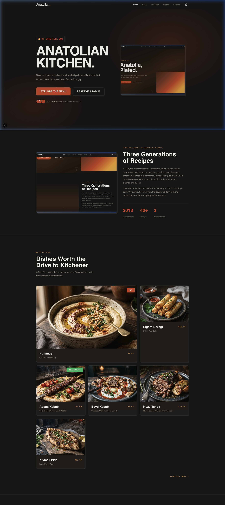
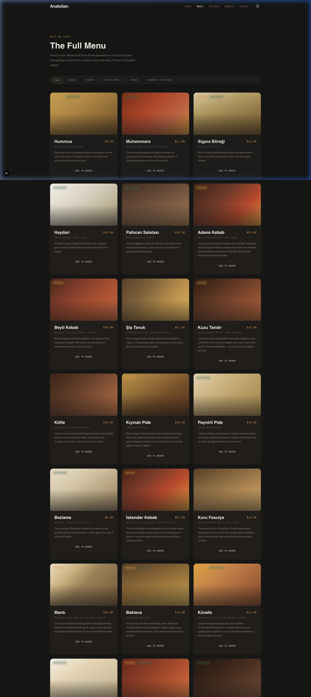
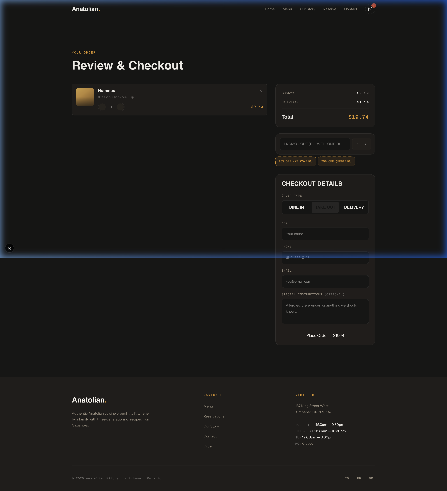

# Saray — Authentic Turkish Kitchen 🥘

A modern, high-performance web application for a Turkish restaurant, featuring a bold Brutalist aesthetic, seamless animations, and built-in social engineering techniques to drive conversions. Built with **Next.js**, **React**, and **Framer Motion**.

## 📸 Screenshots

### Home Page


### Menu Page


### Checkout Flow


## ✨ Features

- **Brutalist UI/UX**: High contrast, bold typography, sharp borders, and solid shadows inspired by modern digital aesthetics.
- **Engaging Animations**: Snappy, physics-based scroll reveals and interactive hover effects powered by `framer-motion`.
- **Social Engineering & Conversions**:
  - "HOT" and "SELLING FAST" scarcity badges on menu items.
  - Interactive Promo Codes (e.g., WELCOME10, KEBAB20) to incentivize higher cart values.
  - Seamless, distraction-free checkout flow with dynamic Delivery/Take-Out/Dine-In toggles.
  - Downloadable receipts and order confirmation numbers.
- **Responsive Design**: Flawless experience on both desktop and mobile devices.
- **Next.js App Router**: Optimized performance, image rendering, and SEO out of the box.

## 🚀 Getting Started

First, install the dependencies:

```bash
npm install
```

Then, run the development server:

```bash
npm run dev
```

Open [http://localhost:3000](http://localhost:3000) with your browser to see the result.

## 🛠️ Tech Stack

- **Framework**: [Next.js 14](https://nextjs.org/) (App Router)
- **Styling**: Vanilla CSS (Global CSS Variables) with customized Brutalist design tokens
- **Animations**: [Framer Motion](https://www.framer.com/motion/)
- **State Management**: React Context API (`OrderContext.tsx`)
- **Notifications**: [Sonner](https://sonner.emilkowal.ski/)

## 📦 Key Directory Structure

- `/app`: Core routing, global layouts, and main pages.
- `/components/marketing`: Landing page sections (Hero, Menu Highlights, Testimonials, About).
- `/components/order`: Checkout logic, Order Summary, Cart Items, and Confirmation modals.
- `/context`: Centralized cart and discount code state.
- `/public/images`: High-quality food photography and aesthetic assets.

---
*Built to bring the authentic taste of Gaziantep to the modern web.*
